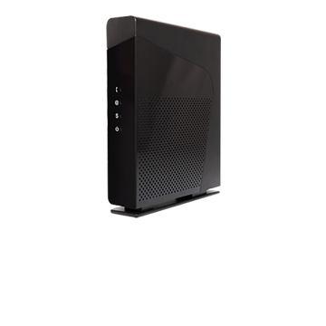

# NB6VAC-FXC

:fr: Documentation et outils pour box SFR NB6VAC-FXC et compatibles.

:gb: Documentation and tools for SFR NB6VAC-FXC boxes and compatible.

## My box

|  |   |
|-----------------------|------------------------|
| Modèle                | NB6VAC-FXC-r0          |
| Version principale    | NB6VAC-MAIN-R4.0.45d   |
| Version de secours    | NB6VAC-MAIN-R4.0.44k   |
| Version driver DSL    | NB6VAC-XDSL-A2pv6F039p |

|  |
|--|
| NB6VAC-FXC |

## Hidden web page

* http://192.168.1.1/state/lan/extra
* http://192.168.1.1/network/lan
* http://192.168.1.1/rootfs
* http://192.168.1.1/state/device/plug
* http://192.168.1.1/maintenance/dsl/config

## Public Documentations

* [deviwiki.com/wiki/SFR_Neufbox_6](https://deviwiki.com/wiki/SFR_Neufbox_6) ([web.archive.org](https://web.archive.org/web/20230131163452/https://deviwiki.com/wiki/SFR_Neufbox_6))
* [fr.wikipedia.org/wiki/La_box_de_SFR](https://fr.wikipedia.org/wiki/La_box_de_SFR)
* ~~[openbox4.fhocorp.com](http://openbox4.fhocorp.com/doc/)~~ ➡️ [web.archive.org](https://web.archive.org/web/20220309022737/http://openbox4.fhocorp.com/doc/)
* lafibre.info
  * [NB6VAC telnet et autres infos cachées de la box](https://lafibre.info/sfr-la-fibre/nb6vac-telnet-et-autres-infos-cachees-de-la-box/) ([web.archive.org](https://web.archive.org/web/20230131164850/https://lafibre.info/sfr-la-fibre/nb6vac-telnet-et-autres-infos-cachees-de-la-box/))
* [reboot_nb6.sh](https://gist.github.com/notFloran/5788412/revisions)

